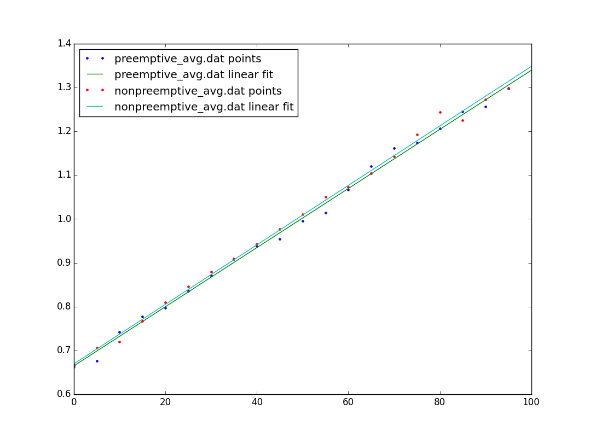

# Preemptive-Controller-Message
Experiments on the preemptive behavior of SDN controller message in openvswitch.

## Build Instructions
1. Platform:
  * Arch Linux

2. Prerequisite:
  * build tools (gcc, make, git, ...)
  * Python 2.7.x
  * Open vSwitch >= 2.3.1 ([Download](http://openvswitch.org/download/), compile and install without kernel modules)
  * Mininet >= 2.2.0
  * Ryu >= 3.19

3. Compile modified linux kernel (unless specified otherwise, all commands are executed in root directory of the project)
  1. Clone kernel submodule
    ```shell
    git submodule init
    git submodule update --depth=1
    ```

  2. Compile kernel
    ```shell
    cd linux
    make mrproper
    zcat /proc/config.gz > .config      # use system default kernel config
    make olddefconfig
    make -j4                            # compile using 4 threads
    ```

  3. Install kernel
    ```shell
    cd linux
    sudo make modules_install
    sudo cp arch/x86_64/boot/bzImage /boot/vmlinuz-linux
    sudo mkinitcpio -p linux            # regenerate initramfs
    ```

  4. Compile Open vSwitch modules
    ```shell
    bash genmodules.sh
    ```

  5. Reboot

## Usage
An automated test shell script is provided by ``runtest.sh``:
```shell
sudo bash runtest.sh
```

The script performs tests across different flow miss rates with or without preemptive behaviors, generating:
* ``preemptive_full.dat``: contains full test results of preemptive behaviors;
* ``nonpreemptive_full.dat``: contains full test results of non-preemptive behaviors;
* ``preemptive.dat``: contains an array of average costs of preemptive behaviors;
* ``nonpreemptive.dat``: contains an array of average costs of non-preemptive behaviors.

Additionally, the shell script will display a graph based on data gathered when tests are completed.

## Result
* Preemptive Data (100k pkts)

  | Flow Miss Rate (%) | Total Cost (ms) | Average Cost (ms) | Max (ms) | Min (ms) |
  |--------------------|:---------------:|-------------------|:--------:|:--------:|
  |         0%         |      66561      |       0.666       |    10    |     0    |
  |         5%         |      67647      |       0.676       |    10    |     0    |
  |         10%        |      74166      |       0.742       |    11    |     0    |
  |         15%        |      77666      |       0.777       |    10    |     0    |
  |         20%        |      79733      |       0.797       |    11    |     0    |
  |         25%        |      83646      |       0.836       |     9    |     0    |
  |         30%        |      87136      |       0.871       |    10    |     0    |
  |         35%        |      90755      |       0.908       |     9    |     0    |
  |         40%        |      93836      |       0.938       |     9    |     0    |
  |         45%        |      95394      |       0.954       |    10    |     0    |
  |         50%        |      99492      |       0.995       |    10    |     0    |
  |         55%        |      101379     |       1.014       |    10    |     0    |
  |         60%        |      106714     |       1.067       |    10    |     0    |
  |         65%        |      112026     |       1.120       |    10    |     0    |
  |         70%        |      116120     |       1.161       |    12    |     0    |
  |         75%        |      117423     |       1.174       |    11    |     0    |
  |         80%        |      120720     |       1.207       |    11    |     0    |
  |         85%        |      124502     |       1.245       |    40    |     0    |
  |         90%        |      125624     |       1.256       |    11    |     0    |
  |         95%        |      129765     |       1.298       |    13    |     0    |

* Non-preemptive Data (100k pkts)

  | Flow Miss Rate (%) | Total Cost (ms) | Average Cost (ms) | Max (ms) | Min (ms) |
  |--------------------|:---------------:|-------------------|:--------:|:--------:|
  |         0%         |      66161      |       0.662       |    44    |     0    |
  |         5%         |      70585      |       0.706       |    10    |     0    |
  |         10%        |      72023      |       0.720       |    11    |     0    |
  |         15%        |      76675      |       0.767       |     9    |     0    |
  |         20%        |      80900      |       0.809       |    15    |     0    |
  |         25%        |      84583      |       0.846       |     9    |     0    |
  |         30%        |      88014      |       0.880       |    11    |     0    |
  |         35%        |      90898      |       0.909       |     9    |     0    |
  |         40%        |      94272      |       0.943       |    52    |     0    |
  |         45%        |      97689      |       0.977       |    10    |     0    |
  |         50%        |      101007     |       1.010       |     9    |     0    |
  |         55%        |      105077     |       1.051       |    13    |     0    |
  |         60%        |      107320     |       1.073       |    10    |     0    |
  |         65%        |      110410     |       1.104       |    14    |     0    |
  |         70%        |      114346     |       1.143       |    11    |     0    |
  |         75%        |      119258     |       1.193       |    11    |     0    |
  |         80%        |      124427     |       1.244       |    40    |     0    |
  |         85%        |      122526     |       1.225       |    10    |     0    |
  |         90%        |      127283     |       1.273       |    20    |     0    |
  |         95%        |      129896     |       1.299       |    13    |     0    |



## Userspace Implementation
Userspace Openflow virtual switch implementation with preemptive behavior can be found in directory ``openflow/``. This implementation is based on Openflow 1.0 standard reference switch from Stanford University, but unfortunately it comes with poor performance, link speed of which is measured 1Mbit/s, comparing to ~20Gbit/s on Open vSwitch. For those who interested, build instructions are followed (clang required).
```shell
cd openflow
./configure --prefix=/usr --localstatedir=/var CC=clang
make
sudo make install
```
The code adds an argument ``--prioritize`` to original datapath simulator ``ofdatapath``. To use it with Mininet, specify using ``UserSwitch`` when creating topology and pass the parameter ``--prioritize`` when constructing switches:
```python
from mininet.node import UserSwitch
net = Mininet(switch = UserSwitch)
net.addSwitch('s1', dpopts = '--prioritize')
```

## Contact
Any questions, please email to mystery.wd#gmail.com.
This project is licensed under GPLv2, see [LICENSE](./LICENSE).
